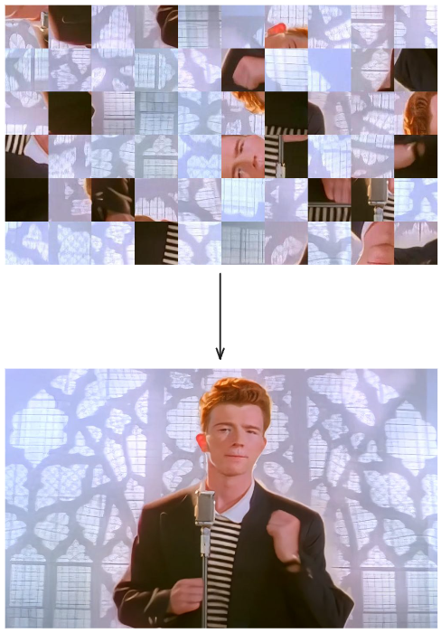
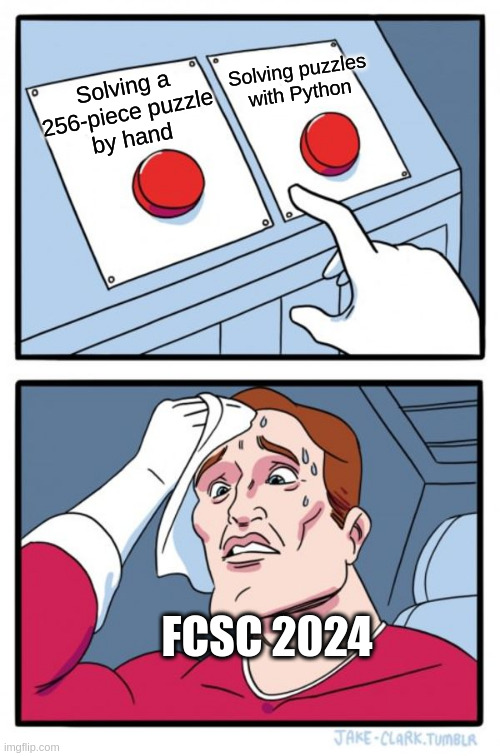

# Tiled image Scrambler/Unscrambler

Little application made with tkinter used to split and switch the tiles of an image.

Switch two tiles with left click, and rotate the tile with right click.

This project was originally made after being taunt by the meme used in FCSC 2024 with the challenge "Puzzle Trouble hard":

The app might have a few bugs, this is my first project using tkinter.

There's one known bug I couldn't solve when rotating the tiles:

If you're trying to rotate a squared tile, it happens that when the image is rezised by the app, the tiles are not squared anymore (usually by 1 pixel), so you're forced to make 180 degrees rotation instead of 90. If it happens, you can try to resize your window to update the image's size.